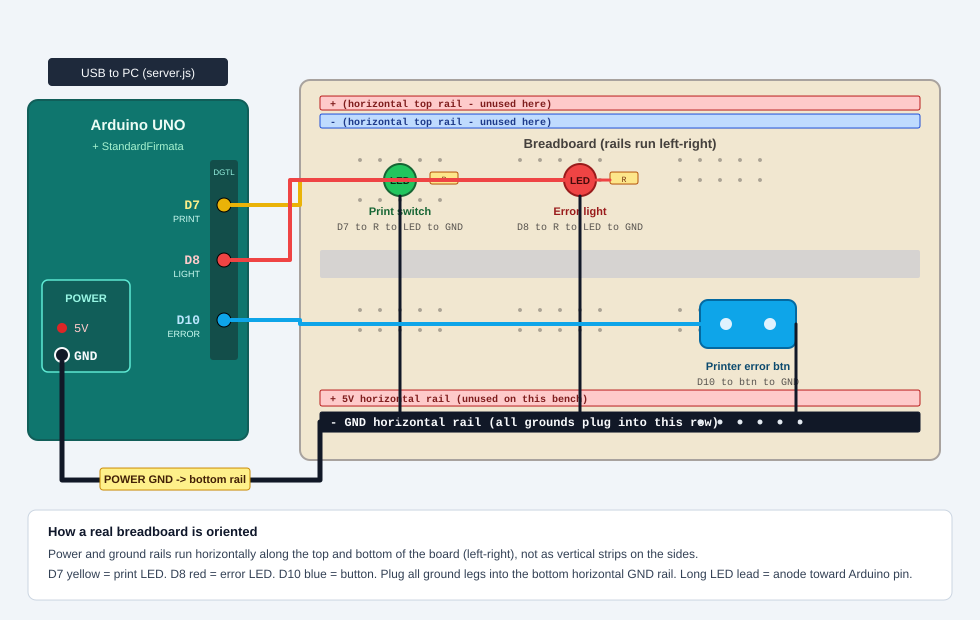
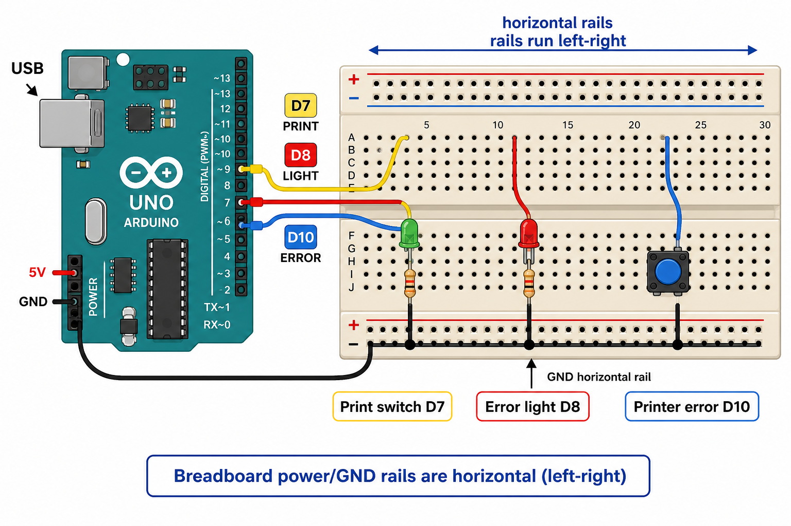

# Arduino breadboard wiring (local printer testing)

Bench-test the kiosk without a real ticket printer. Pin map matches [server.js](../server.js).

## Wiring diagram



Photo-style alternate (always works in Markdown preview):



---

## Pins

| Signal | Arduino pin | Code constant | Production | Breadboard stand-in |
| --- | --- | --- | --- | --- |
| Printer error / contact closure | **D10** | `PRINTER_ERROR_BUTTON_PIN` | Momentary contact when printer is in error | Tactile N.O. button to GND |
| Error light | **D8** | `LIGHT_PIN` | Error lamp relay | Red LED + ~220 Ω |
| Print switch | **D7** | `PRINTER_RELAY_PIN` | Ticket print relay | Green LED + ~220 Ω |

Firmware: upload **StandardFirmata** (or CompatibleFirmata) so Johnny-Five can talk over USB serial.

Button uses **internal pull-up** (`isPullup: true`):

| Mode | Button | D10 | `printerOk` | App path |
| --- | --- | --- | --- | --- |
| **Printer connected** | Released (open) | HIGH | `true` | Physical print flow; D7 LED on `/printTicket` |
| **Printer not connected / error** | Held (D10–GND) | LOW | `false` | Digital ticket; D8 error LED on |

Print is not a button. UI calls `GET /printTicket` → `PrinterSwitch.close()` for `TICKET_PRINT_HOLD_MS` (default 3000 ms) → open. That is the green **D7** LED blip.

---

## Connections

1. **GND** — Arduino **POWER header GND** → breadboard **bottom horizontal** ground rail (the black `–` strip that runs left–right). Plug LED cathodes and the free side of the error button into that same rail.
2. **D10** — pin → one side of pushbutton → other side into the **horizontal GND rail** (no external pull-up).
3. **D8** — pin → 220 Ω → red LED anode (long lead) → cathode (short lead) into **horizontal GND rail** (red wire).
4. **D7** — pin → 220 Ω → green LED anode (long lead) → cathode (short lead) into **horizontal GND rail** (yellow wire).

Real breadboards put power/ground as **horizontal** side rails (top and bottom), not vertical strips. Terminal strips (middle) are vertical columns in groups of five.

Production hardware uses relays on D7/D8; LEDs only stand in for pin activity on a bench. Drive coils with a proper driver and freewheeling diode, not a bare GPIO pin.

---

## Quick tests

### Printer connected

1. USB in; `node server.js` → wait for `board is ready!`
2. Leave error button **up**
3. `GET http://127.0.0.1:3002/printer-status` → `"printerOk": true`
4. Walk to spinner or hit `GET /printTicket` → green D7 LED for ~3 s

### Printer error / not connected

1. **Hold** error button (or jumper D10–GND)
2. SSE / status → `printerOk: false`; red D8 LED on
3. UI takes digital ticket path
4. Release → OK again

### No Arduino

```bash
TICKET_PRINTER=false node server.js
```

Forces `printerOk = false` without hardware (used by e2e).
